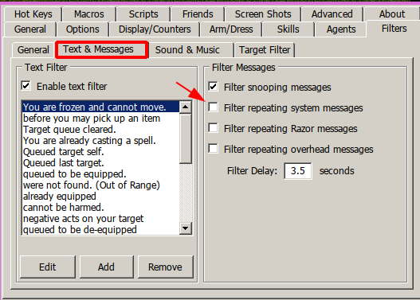

**# LUMBER BOT by gugutz**

**Requirements**

- A **runebook** named **HOME** with your home rune set as default
- 1 or more **runetomes** with the word **LUMBER** on their names
- Enable Cooldowns in Client Options
  
- Uncheck option 'filter repeating system messages' on razor
  
- Uncheck option 'Auto Stack Ore/Fish/Logs at feet' on razor
  
- First run far from other friends pack animals

**Features**

- Stops at Captcha Gumps and awaits for user response to continue
- Auto walk randomly (default: **on**)
- Auto walk to specific diretion (default: **off**)

- Auto turns tracking on
- Auto re-equips pickaxe whenever needed
- Auto finds all char packies and use them to unload.
- Auto names packies according to weight ('emptypackie', 'lightpackie', 'fullpackie')
- Detects when a packie is heavy and skips to next packie in list
- Auto grabs ores found on ground
- Auto travel home to escape PKs
- Auto travel home when all packies are full
- Configurable rune position to auto travel (runetome or runebook)
- Recall via charges for non-magery characters
- Auto heal/cure
- Fights mobs in scenario for non magery chars
- Auto equips best weapon based on char weapon skill)
