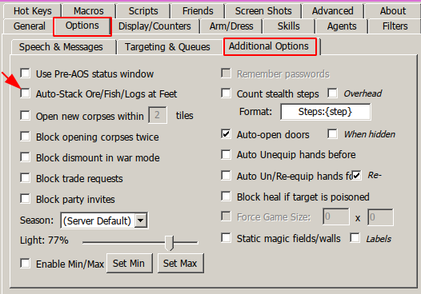

# LUMBER BOT by gugutz

## Features

- Stops at Captcha Gumps and awaits for user response to continue
- Auto walk randomly (default: **on**)
- Auto walk to specific diretion (default: **off**)
- Auto turns tracking on
- Auto re-equips pickaxe whenever needed
- Auto finds all char packies and use them to unload.
- Auto names packies according to weight ('emptypackie', 'lightpackie', 'fullpackie')
- Detects when a packie is heavy and skips to next packie in list
- Option to use Hotel Room (own or friend's)
- Auto travel home to escape PKs
- Auto travel home when all packies are full
- Configurable rune position to auto travel (runetome or runebook)
- Auto heal/cure
- Recall via charges for non-mage characters
- Fights mobs in scenario for non-mage chars (auto equips best weapon based on char weapon skill)

## Running the Script

To run the script you need to have:

- A **runebook** named **HOME** with your home rune set as default
- 1 or more **runetomes** with the word **LUMBER** on their names
- Some cooldowns set up on your client. [Download the cooldowns.xml with all the required cooldowns here](../../cooldowns.xml)
- After downloading, place the **cooldowns.xml** file on your lumber character profile folder `(Outlands\Data\Profiles\Your Char Name)`
- Enable Cooldowns in Client Options

  

- Uncheck option 'filter repeating system messages' on razor

  

- Uncheck option 'Auto Stack Ore/Fish/Logs at feet' on razor

  

- First run far from other friends pack animals
- If your character uses a hotel room instead of a house:
  - Search for the following line in the script:
    ```
    setvar! use_hotel_room 0
    ```
    Change to:
    ```
    setvar! use_hotel_room 1
    ```
  - If your character uses its own room (and not a friend's room), search for the line:
    ```
    setvar! use_own_room 0
    ```
    Change to:
    ```
    setvar! use_own_room 1
    ```

## Manual Lumbering

Please note that the LUMBER runetome is not required at all.

If you dont want to cycle runes and just want to lumber controlling your character manually, just play the script without any LUMBER runetomes and the character wont try to recall
