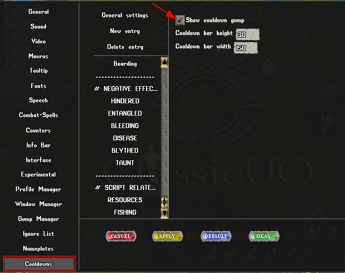

**# LUMBER BOT by gugutz**

**Requirements**

```md
- First run far from other friends pack animals
- A **runebook** named **HOME** with your home rune set as default
- 1 or more **runetomes** with the word **LUMBER** on their names
- Enable Cooldowns in Client Options
  
- Uncheck option 'filter repeating system messages' on razor
  - Uncheck option 'Auto Stack Ore/Fish/Logs at feet' on razor
- Uncheck option 'Auto Stack Ore/Fish/Logs at feet' on razor
  
```

**Features**

```md
- Stops at Captcha Gumps and awaits for user response to continue
- Auto turns tracking on
- Auto re-equips pickaxe whenever needed
- Auto finds all char packies and use them to unload.
- Auto names packies according to weight ('emptypackie', 'lightpackie', 'fullpackie')
- Detects when a packie is heavy and skips to next packie in list
- Auto grabs ores found on ground
- Auto travel home to escape PKs
- Auto travel home when all packies are full
- Configurable rune position to auto travel (runetome or runebook)
- Auto use recall charges to travel if char doenst have magery
- Monitors and maintain char health (cure poison, heal pots, bandages, mage heals...)
- Autoheals with best skills available (pot > bandage (with timer) > mageheals)
- Auto smelt ores when: (default: on)
  - Within 2 tiles of player forges
  - Close to some hardcoded map forges locations
- Option to not smelt colored ores (PKs cant smelt colored ores so makes it hard for them to take em)
- Fights mobs in scenario (auto equips best weapon based on char weapon skill)
- Auto walk randomly (default: off)
- Auto walk to specific diretion (default: off)
- Waits world saves
- Detects when char is resource locked (by failing a previous captcha) and stops script
```
