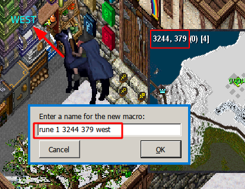

# MINING BOT by gugutz

## Features

All features listed here are configurable. You can turn each of them on and off by switching zeroes and ones inside the **mining_config.razor** file.

- Stops at Captcha Gumps and awaits for user response to continue
- Auto Cycle Runetomes
- Auto turns tracking on at start
- Auto summon
- Auto drain nearby corpses to increase summons duration
- Auto detect and escape nearby thiefs
- Auto re-equips pickaxe whenever needed
- Use Hotel Room (own or friend's)
- Auto travel home to escape PKs
- Auto use recall charges to travel if char doenst have magery
- Auto smelt ores when close to known or player forges: (default: on)
- Configurable rune position to auto travel (runetome or runebook)
- Recall via charges for non-mage characters
- Fights mobs in scenario for non-mage chars (auto equips best weapon based on char weapon skill)
- Monitors and maintain char health (cure poison, heal pots, bandages, mage heals...)
- Informs what color ore is being gathered
- Option to not smelt colored ores (makes it harder for PKs to take em)

#### _Walk Modes_

- Auto rails (default: off).
- Auto walk randomly (default: off)
- Auto walk to specific diretion (default: off)
- Manual walk (default: on)

#### _Packies Features_

- Auto finds all char packies and use them to unload.
- Auto names packies according to weight: `emptypackie`, `lightpackie`, `fullpackie`
- Detects when a packie is heavy and skips to next packie in list
- Auto travel home when all packies are full

#### _Other Features_

## Character config overides

At the very bottom of the script **mining_config.razor** you will notice some `if`s that check for the character name and sets some variables.

Those `if` blocks are placed at the end so that any variable set in them will override the "default" ones set at the beggining of the file.

This way you can use use those blocks to set different script options for each of your characters without having to create different copies of the script.

Example of a config override that sets `walk_mode` to manual and disables auto summon for a character named Newbie

```py
if name == 'Newbie'
    setvar! walk_mode 4
    setvar! auto_summon 0
endif
```

## Running the Script

To run the script you need to have:

- A **runebook** named **HOME** with your home rune set as default.
  If your char doenst have magery and uses Recall Charges, the home rune needs to be the first rune in the runebook
- 1 or more **runetomes** with the word **MINING** on their names _(not required for manual walk mode)_
- Some cooldowns set up on your client. [Download my cooldowns.xml with all the required cooldowns here](../../cooldowns.xml). After downloading, place the **cooldowns.xml** file on your mining character profile folder `(Outlands\Data\Profiles\Your Char Name)`
- Enable Cooldowns in Client Options

  

- Uncheck option `Filter repeating system messages` on razor

  

- Uncheck option `Auto Stack Ore/Fish/Logs at feet` on razor

  

- First run far from other friends pack animals
- If your character uses a hotel room instead of a house:
  - Search for the following line in the script:
    ```
    setvar! use_hotel_room 0
    ```
    Change to:
    ```
    setvar! use_hotel_room 1
    ```
  - If your character uses its own room (and not a friend's room), search for the line:
    ```
    setvar! use_own_room 0
    ```
    Change to:
    ```
    setvar! use_own_room 1
    ```

## Requirements

```md
- First run far from other friends pack animals
- Uncheck option 'filter repeating system messages' on razor
- Uncheck option 'Auto Stack Ore/Fish/Logs at feet' on razor
```

## COOLDOWNS

This script needs cooldowns set up in the client in order to work
You can download the **cooldowns.xml** file at the root of my repo with all the cooldowns set up.

The main cooldown is the 'RESOURCES' cooldown

ADD THESE TRIGGERS TO THE COOLDOWN:
Type: sysmsg | Text: you dig some
Type: sysmsg | Text: You have recently traveled
Type: sysmsg | Text: You have worn out your tool
Type: sysmsg | Text: The world is saving
Type: sysmsg | Text: You do not see any harvestable resources nearby
Type: sysmsg | Text: loosen some rocks but fail
Type: sysmsg | Text: You must wait to perform another action
Type: sysmsg | Text: Harvesting is not allowed in this area

# WALK MODES

This script supports 4 walking modes.

To select the walking mode, open the script **mining_config.razor** and on your character config, set the variable `walk_mode` acording to the mode you want:

0.  **Manual walking**

    Turn off movement. You can control how your character move

1.  **Auto Rail**

    Char walks a specific router you define at each rune.

2.  **Auto Walk Randomly**

    Char walks X steps at a random direction everytime a tree is empty. It tries to find 20 trees and goes to next rune.

3.  **Auto Walk To Specific Direction**

    Char walks only to 1 direction that you set in script config.

## Auto Rail

To use auto rail, you need to record a macro for every rune you intend to use on your mining runetome. If you use 5 runes, you will need to record 5 macros.

These macros are very simple macros where you just click Record and walk the route you desire your char to walk when traveling to that rune. After creating the macro and finishing walking the desired route, you have to convert that macro using the awesome Razor2Rail by @maldogi.

I have compiled a version of Maldogi's Razor2Rail that changes the script being called at the end of each rail to point to where my script is located (`resources\mining\mining`). [You can download it here](../razor-to-rail.zip) (PS: you need dotnet 6.0.10 installed to run it)

**HOW TO SET YOUR RAILS**

1. Travel to the rune you want to record a rail to
2. Leave your character at the exact spots it recalls into
3. Go to Razor > Macros, and click **New** to start a new macro
4. Name the macro with the following information:

   - the rune number
   - char X
   - char Y
   - the directiojn the char is facing for its first step

     

5. After creating the macro, select it and click **Record**
6. Walk the route you want your char to walk. **Be very careful here!!** If you take a wrong turn and suddently hit a rock or a tree, or if you moved your character to a direction but it hit something and ended up moving to a different direction, stop the recording, recall to starting point and start recording over again. The rail should be a safe path or else the script will bug!
7. After reachign the end of your desired route, click Stop to stop the recording.
8. Open Razor2Rail and click Open
9. Go to your macros folder (usually `ClassicUO\Plugins\Assistant\Macros`)
10. Select the macro your just recorded and open it.
11. Now fill in your character X and Y
12. Mark the **Mining** box
13. Choose the starting direction for your rail.
14. Click **Convert**.

    

15. After that go to Razor2Rail folder and there should be a razor script there named with the starting coordinates of your rail (your character starting X and Y)
16. Rename that razor script in this **exact** format:
    **book-X-rail-X.razor**
    Where the first X is the runetome the rune is in, and the second X is the rune number.
    So for the first runetome and the first rune in it, the name should be:
    **book-1-rail-1.razor**
    The second rune of the same book would be:
    **book-1-rail-2.razor**
    and so on...
17. After renaming the script acoordingly, put it int he same folder with the mining script (which should be inside the `resources\mining` folder)
18. Reapeat above steps for each rune you want to setup a rail for. After finishing, just hit **Play** and the script should recall to each rune and walk the rail you set!

## Manual Mining

If you want to just manually control your character while enjoying all the benefits of the script, set `walk_mode` to `4` in script **mining_config.razor**

Then move the rail file into the same folder as the mining script (in the above exemple: 'resources\mining')
