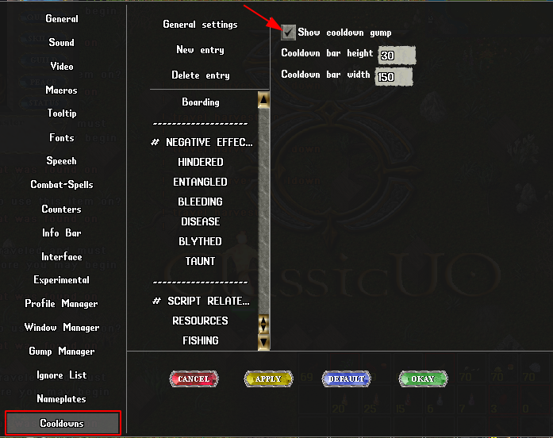
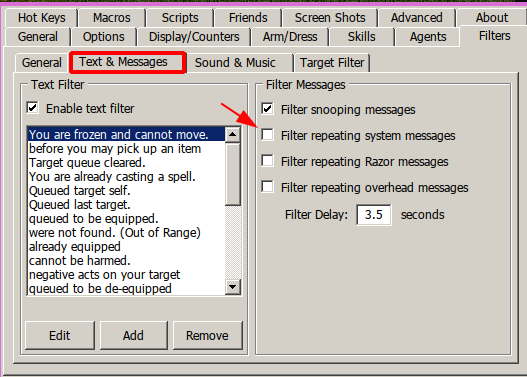
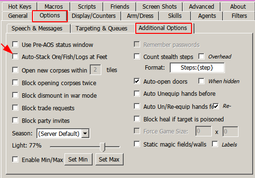

# MINING BOT by gugutz

## Features

All features listed here are configurable. You can turn each of them on and off by switching zeroes and ones inside the **mining_config.razor** file.

- Stops at Captcha Gumps and awaits for user response to continue
- Auto Cycle Runetomes
- Auto summon
- Skip to next rune by turning off a lantern
- Auto turns tracking on at start
- Auto drain nearby corpses to increase summons duration
- Auto detect and escape nearby thiefs
- Auto re-equips pickaxe whenever needed
- Use Hotel Room (own or friend's)
- Auto travel home to escape PKs
- Auto use recall charges to travel if char doenst have magery
- Auto smelt ores when close to known or player forges: (default: on)
- Configurable rune position to auto travel (runetome or runebook)
- Recall via charges for non-mage characters
- Fights mobs in scenario for non-mage chars (auto equips best weapon based on char weapon skill)
- Monitors and maintain char health (cure poison, heal pots, bandages, mage heals...)
- Informs what color ore is being gathered
- Option to not smelt colored ores (makes it harder for PKs to take em)

#### _Packies Features_

- Auto finds all char packies and use them to unload.
- Auto names packies according to weight: `emptypackie`, `lightpackie`, `fullpackie`
- Detects when a packie is heavy and skips to next packie in list
- Auto travel home when all packies are full

#### _Other Features_

## Sript Configuration

All settings are inside the separate file `resources\mining\config.razor`.

At the very bottom of this file you will notice some `if`s that check for the character name and sets some variables, for instance:

```py
if name == 'Emacs'
    setvar! auto_summon 1
    setvar! use_harvest_aspect 1
endif
```

`Emacs` is my character name, and that `if` block is his personalized config. The variables set inside this `if` block will override all the "default" variables set at the beggining of the file.

You can change the character names in those blocks or make copy of them to set specific script options for each of your characters without having to create different copies of the script.

This is also usefull for when the main mining script gets updated, you wont have to configure it to your liking again.

## Running the Script

To run the script you need to have:

- A **runebook** named `HOME` with your home rune set as default.
  If your char doenst have magery and uses Recall Charges, the home rune needs to be the first rune in the runebook
- 1 or more **runetomes** with the word `MINING` on their names
- A lantern on hand if you wanna be able to go to next rune by turning it off
- Some cooldowns set up on your client. [Download my cooldowns.xml with all the required cooldowns here](../../cooldowns.xml). After downloading, place the **cooldowns.xml** file on your mining character profile folder `(Outlands\Data\Profiles\Your Char Name)`

  If you prefer to set them manually, create a new cooldown called RESOURCES with the following triggers:

  - Type: sysmsg | Text: you dig some
  - Type: sysmsg | Text: You have recently traveled
  - Type: sysmsg | Text: You have worn out your tool
  - Type: sysmsg | Text: The world is saving
  - Type: sysmsg | Text: You do not see any harvestable resources nearby
  - Type: sysmsg | Text: loosen some rocks but fail
  - Type: sysmsg | Text: You must wait to perform another action
  - Type: sysmsg | Text: Harvesting is not allowed in this area

- Enable Cooldowns in Client Options

  

- Uncheck option `Filter repeating system messages` on razor

  

- Uncheck option `Auto Stack Ore/Fish/Logs at feet` on razor

  

- First run far from other friends pack animals
- If your character uses a hotel room instead of a house:
  - Search for the following line in the script:
    ```
    setvar! use_hotel_room 0
    ```
    Change to:
    ```
    setvar! use_hotel_room 1
    ```
  - If your character uses its own room (and not a friend's room), search for the line:
    ```
    setvar! use_own_room 0
    ```
    Change to:
    ```
    setvar! use_own_room 1
    ```
